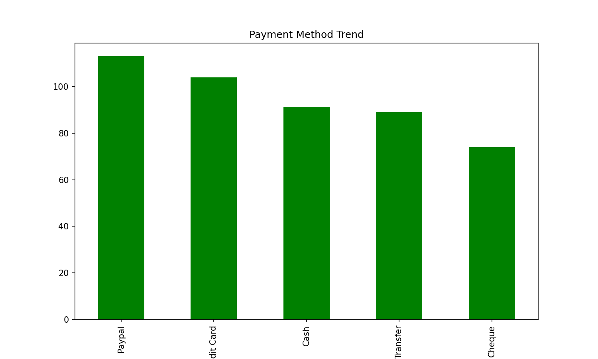
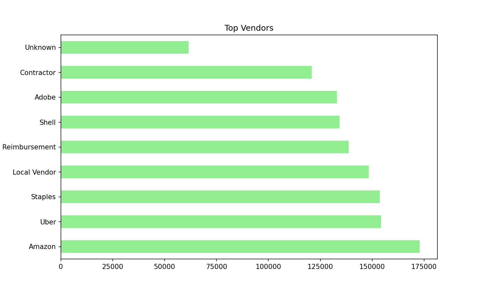

# Financial Data Cleaning & Budget Analysis — Automated with Python & Excel 💰📊  

  
  
  
  

## 📌 Problem  
Companies deal with **messy expense reports** — missing values, inconsistent categories, and unstructured formats.  
Manual financial analysis & budgeting is **slow, error-prone, and inefficient**.  

## ✅ Solution  
This project automates:  
- 🔹 Cleaning & standardizing financial transaction data  
- 🔹 Categorizing expenses (Office, Travel, Meals, etc.)  
- 🔹 Budget vs. Actual spend analysis  
- 🔹 Auto-generated Excel report with **spending insights & charts**  

## 📂 Project Structure  
Financial-Data-Budget-Analysis/
│── data/
│ ├── raw/ # Original financial reports
│ ├── clean/ # Cleaned datasets
│── reports/
│ ├── Financial_Report.xlsx # Final Excel with charts
│── notebooks/
│ ├── financial_analysis.ipynb
│── visuals/
│ ├── category_spend.png
│ ├── monthly_trends.png
│── README.md

## 📊 Demo Screenshots  
  
  
  
  

## 📈 Key Insights from Analysis  
- **Category-wise spend breakdown** (Office, Travel, Meals, etc.)  
- **Budget vs Actual variance** detection  
- **Monthly expense trends** highlighting high-spend periods  
- **Identification of anomalies & irregular transactions**  

## 📥 Excel Report Download  
➡️ [Download Financial Report](Financial_data_Analysis/Data/Clean/Financial_DATA.xlsx)  

